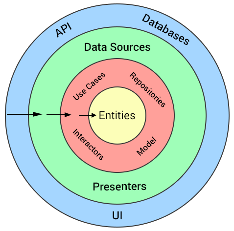
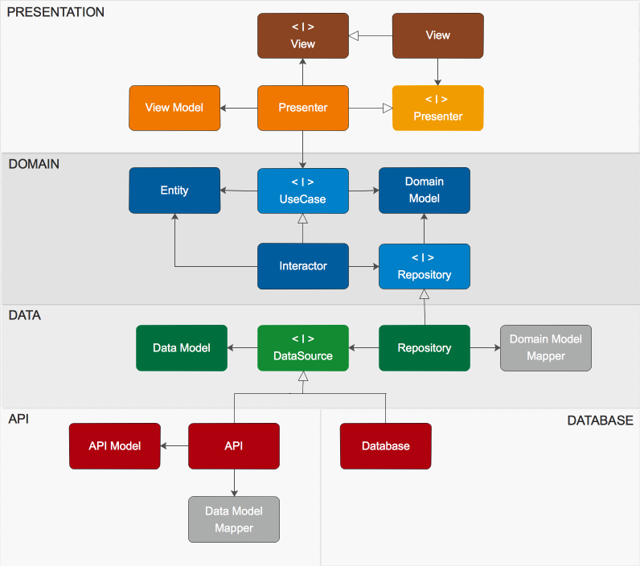

# Software Principles

At fuboTV we strive to provide clean, maintainable, and high performing code. Below you can find a collection of best practices and principles we follow when designing and developing Android apps.

## Clean

The concentric circles represent different areas of software. The outer circles are mechanisms (low level concrete details), and the inner circles are policies. As you move inwards the software grows more abstract, and encapsulates higher level policies. The inner most circle is the most general.

The overriding rule that makes this architecture work is **The Dependency Rule**, which states:

`Source code dependencies can only point inwards. Nothing in an inner circle can know anything at all about something in an outer circle. In particular, the name of something declared in an outer circle must not be mentioned by the code in the an inner circle. That includes, functions, classes. variables, or any other named software entity. Data formats used in an outer circle should not be used by an inner circle, especially if those formats are generate by a framework in an outer circle. We should not let an outer circle impact the inner circles.`

## Our approach ([as seen in front-end project](https://github.com/fubotv/fubotv_android_v3/))

The number of circles in the above diagram are schematic. There's no rule that states how many layers we must have. However, **The Dependency Rule** always applies. Source code dependencies always point inwards.

The Android app is conceptually layered as follows:

- Outer layer: Presentation (using MVP stack), API implementation, Database implementation.
- Middle layer: Data source interfaces, model mappers, and Use Case interfaces.
- Inner layer: Interactors, Entities, Models and Repositories interfaces.

The Android project organize these layered components in `presentation`, `domain`, `data`, `db` and `api` packages.

- **Presentation**: Presentation package is responsible for everything related to showing things on the screen -- it includes the whole [MVP](https://en.wikipedia.org/wiki/Model%E2%80%93view%E2%80%93presenter) stack (it means it also includes both the UI and Presenter packages even though they belong to different layers in the MVP stack). This is where you put all your Presenters, Activities, Fragments, Adapters and other Android code related to the user interface.

- **Domain**: The domain package contains the most high-level code. All classes here are POJOs. Classes and objects in this layer have no knowledge that they are run in an Android app and can easily be tested with JUnit. This package contains `Interactors` -- these are the classes which actually contain the business logic code. These are run in the background and communicate events to the upper layer using callbacks. `Models` are simply the business data that is manipulated in the business logic. This package also contains `Repositories` interfaces, that the database or some other outer layer implements. These interfaces are used by `Interactors` to access and store data.

- **Data**: Data source specific code that implements the `Repositories` interface our Interactors use for accessing data and storing data. The `Repositories` use the `DataSource` interfaces usually implemented by API component and/or other db technology. This package only contains interfaces that the database or some other outer layer implements. These interfaces are used by Interactors to access and store data.

- **DB**: These package has database related code.

- **API**: Things like HTTP clients and DTO mappers goes here.

### Package structure and components relationship

You might notice the `Repository` dependency on a `DataSource` interface where its implementation can be found in the `API` package (different layer). This might apparently contradict the **The Dependency Rule**, but it's simply the usage of the [Dependency Inversion Principle](https://en.wikipedia.org/wiki/Dependency_inversion_principle).

For example, consider that the `Repository` needs to call the `API` to fetch some data. However, this call must not be direct because that would violate **The Dependency Rule**: No name in an outer circle can be mentioned by an inner circle. So we have `Repository` call an interface (shown here as `DataSource`), and have the `API` in the outer circle to implement it. The same technique is used to in other boundary places.

## SOLID

**S**ingle Responsibility Principle
 - [Overview](https://academy.realm.io/posts/donn-felker-solid-part-1/)
**O**pen-Closed Principle
 - [Overview](https://academy.realm.io/posts/donn-felker-solid-part-2/)
**L**iskov Substitution Principle
 - [Overview](https://academy.realm.io/posts/donn-felker-solid-part-3/)
**I**nterface Segregation Principle
 - [Overview](https://academy.realm.io/posts/donn-felker-solid-part-4/)
**D**ependency Inversion Principle
 - [Overview](https://academy.realm.io/posts/donn-felker-solid-part-5/)

